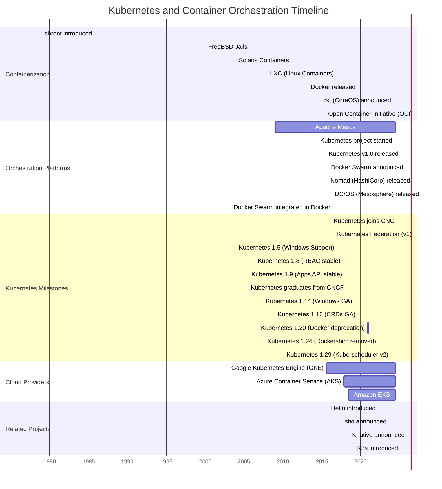

```mermaid 
gantt
    title Kubernetes and Container Orchestration Timeline
    dateFormat  YYYY-MM-DD
    axisFormat  %Y

    section Containerization
    chroot introduced              : 1979-01-01, 1d
    FreeBSD Jails                  : 2000-01-01, 1d
    Solaris Containers             : 2004-01-01, 1d
    LXC (Linux Containers)         : 2008-01-01, 1d
    Docker released                : 2013-03-13, 1d
    rkt (CoreOS) announced         : 2014-12-01, 1d
    Open Container Initiative (OCI): 2015-06-22, 1d

    section Orchestration Platforms
    Apache Mesos                   : 2009-01-01, 2024-06-28
    Kubernetes project started     : 2014-06-06, 1d
    Kubernetes v1.0 released       : 2015-07-21, 1d
    Docker Swarm announced         : 2015-11-03, 1d
    Nomad (HashiCorp) released     : 2015-09-28, 1d
    DC/OS (Mesosphere) released    : 2016-04-19, 1d
    Docker Swarm integrated in Docker: 2016-06-20, 1d

    section Kubernetes Milestones
    Kubernetes joins CNCF          : 2016-03-10, 1d
    Kubernetes Federation (v1)     : 2016-07-28, 1d
    Kubernetes 1.5 (Windows Support): 2016-12-12, 1d
    Kubernetes 1.8 (RBAC stable)   : 2017-09-28, 1d
    Kubernetes 1.9 (Apps API stable): 2017-12-15, 1d
    Kubernetes graduates from CNCF : 2018-03-06, 1d
    Kubernetes 1.14 (Windows GA)   : 2019-03-25, 1d
    Kubernetes 1.16 (CRDs GA)      : 2019-09-18, 1d
    Kubernetes 1.20 (Docker deprecation): 2020-12-08, 1d
    Kubernetes 1.24 (Dockershim removed): 2022-05-03, 1d
    Kubernetes 1.29 (Kube-scheduler v2): 2023-12-13, 1d

    section Cloud Providers
    Google Kubernetes Engine (GKE) : 2015-08-17, 2024-06-28
    Azure Container Service (AKS)  : 2017-10-24, 2024-06-28
    Amazon EKS                     : 2018-06-05, 2024-06-28

    section Related Projects
    Helm introduced                : 2015-11-01, 1d
    Istio announced                : 2017-05-24, 1d
    Knative announced              : 2018-07-24, 1d
    K3s introduced                 : 2019-03-12, 1d
    
```